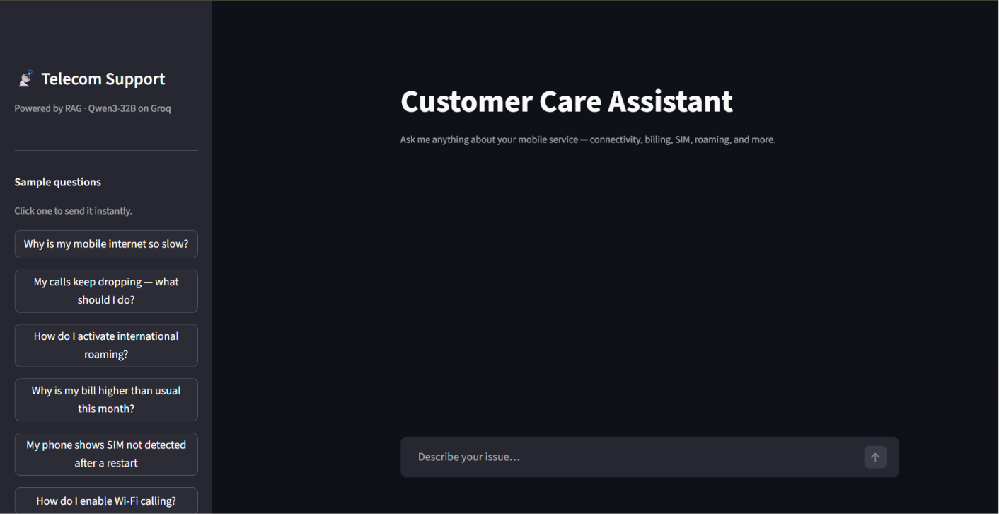

# RAG Telecom Chatbot

A Retrieval-Augmented Generation (RAG) customer care chatbot for telecom support. It answers questions about mobile connectivity, billing, SIM issues, and roaming by retrieving relevant context from three knowledge sources and generating grounded responses with Qwen3-32B via Groq.

Built to explore how far a lightweight, fully local-embedding RAG stack can go in reducing hallucinations for a real-world support use case — while staying fast enough for an interactive chat experience.



## Architecture

```
User question
     │
     ▼
Merged Retriever (top-k from each store)
  ├── ChromaDB · faq        (FAQ entries from CSV)
  ├── ChromaDB · tickets    (resolved support tickets from SQLite)
  └── ChromaDB · guides     (PDF guide chunks)
     │
     ▼
Semantic Similarity Search
     │
     ▼
Confidence Filtering
     │
     ▼
Prompt Construction
     │
     ▼
ChatPromptTemplate → Qwen3-32B (Groq) → Answer + Source Citations
```

**Embedding model:** `sentence-transformers/all-MiniLM-L6-v2` (runs locally via HuggingFace)
**LLM:** `qwen/qwen3-32b` served by [Groq](https://groq.com)

## Project Structure

```
rag-telecom-chatbot/
├── app.py              # Streamlit web UI
├── main.py             # CLI entry point
├── rag_chain.py        # Builds the LangChain RAG chain
├── retriever.py        # Merges the three Chroma retrievers
├── ingest_faq.py       # Loads data/faq.csv → Chroma 'faq' collection
├── ingest_tickets.py   # Loads data/tickets.db → Chroma 'tickets' collection
├── ingest_pdf.py       # Loads data/telecom_guide.pdf → Chroma 'guides' collection
├── data/
│   ├── faq.csv             # FAQ question/answer pairs
│   ├── tickets.db          # SQLite database of resolved support tickets
│   ├── telecom_guide.pdf   # Telecom user guide (chunked at ingest)
│   ├── seed_tickets.py     # Script to seed the tickets database
│   └── generate_pdf.py     # Script to generate the telecom guide PDF
├── chroma_store/       # Persisted Chroma vector database (created at ingest)
├── pyproject.toml
├── uv.lock
└── .env.example
```

## 🛡️ Hallucination Prevention

The chatbot answers **only** from retrieved documents — it never falls back on the LLM's parametric knowledge to fill gaps.

Every retrieved chunk is scored for semantic similarity and passed through a confidence threshold before it's allowed into the prompt context. If nothing clears that bar, the model doesn't get a chance to guess — instead, the app responds with:

> "I couldn't find reliable information in the knowledge base. Please contact customer support by calling 611 or use the MyTelecom app."

This design trades a small amount of coverage for a much larger gain in trustworthiness, which matters a lot in a support context where a confidently wrong answer is worse than no answer.

## Prerequisites

- Python 3.11+
- [uv](https://docs.astral.sh/uv/) (recommended) or pip
- A [Groq API key](https://console.groq.com)
- A [HuggingFace token](https://huggingface.co/settings/tokens) (for downloading the embedding model)

## Setup

**1. Clone and install dependencies**

```bash
git clone <repo-url>
cd rag-telecom-chatbot
uv sync          # or: pip install -e .
```

**2. Configure environment variables**

```bash
cp .env.example .env
```

Edit `.env` and fill in your keys:

```
GROQ_API_KEY=your_groq_api_key_here
HF_TOKEN=your_huggingface_token_here
```

**3. Ingest data into Chroma**

Run the three ingestion scripts once to build the vector store:

```bash
python ingest_faq.py
python ingest_tickets.py
python ingest_pdf.py
```

Each script embeds the source data and persists it to `chroma_store/`. Re-run a script only when its source data changes.

## Running the App

**Streamlit web UI**

```bash
streamlit run app.py
```

Opens at `http://localhost:8501`. The sidebar has one-click sample questions and a button to clear the conversation history.

**CLI**

```bash
python main.py
```

Interactive prompt — type a question and press Enter. Type `quit` to exit.

## Data Sources

| Collection | Source file | Granularity |
|---|---|---|
| `faq` | `data/faq.csv` | 1 document per FAQ row |
| `tickets` | `data/tickets.db` | 1 document per resolved ticket |
| `guides` | `data/telecom_guide.pdf` | Chunks of 600 chars with 100-char overlap |

The retriever performs semantic similarity search across all three collections. Retrieved documents are ranked using similarity scores, filtered using a confidence threshold, and then passed to the language model as context.

## Regenerating Seed Data

```bash
# Seed the SQLite ticket database
python data/seed_tickets.py

# Regenerate the PDF guide
python data/generate_pdf.py
```

After regenerating, re-run the corresponding ingest script.

## License

This project is licensed under the [MIT License](LICENSE).
